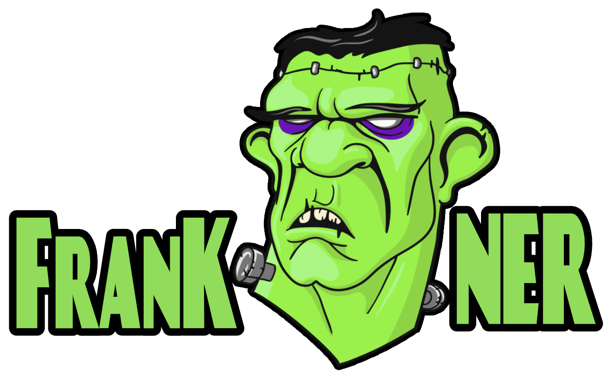

<h1 align="center">
    
</h1>

<h4 align="center">
  An experimental Keras wrapper to facilitate the process of instantiating models of Deep Learning for training named entity recognition tasks.⌛ Loading...
</h4>

This project was created to assist in my research in Natural Language Processing for the Bachelor of Information Systems 🎓

  
  
  

  
	

 

## Experimental - No Patterns

---

Made with ♥ by **[mpgxc](https://www.linkedin.com/in/mpgxc/)**

